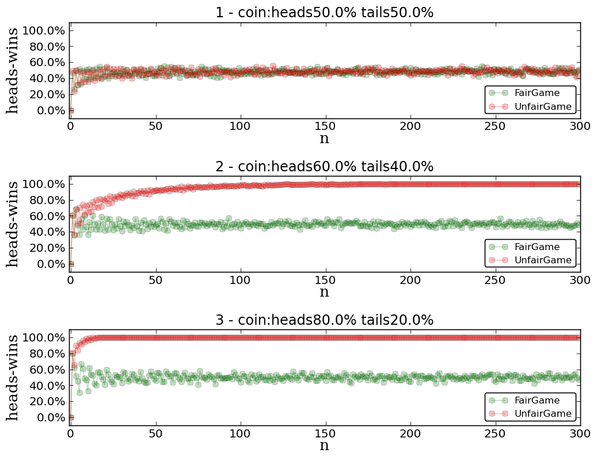
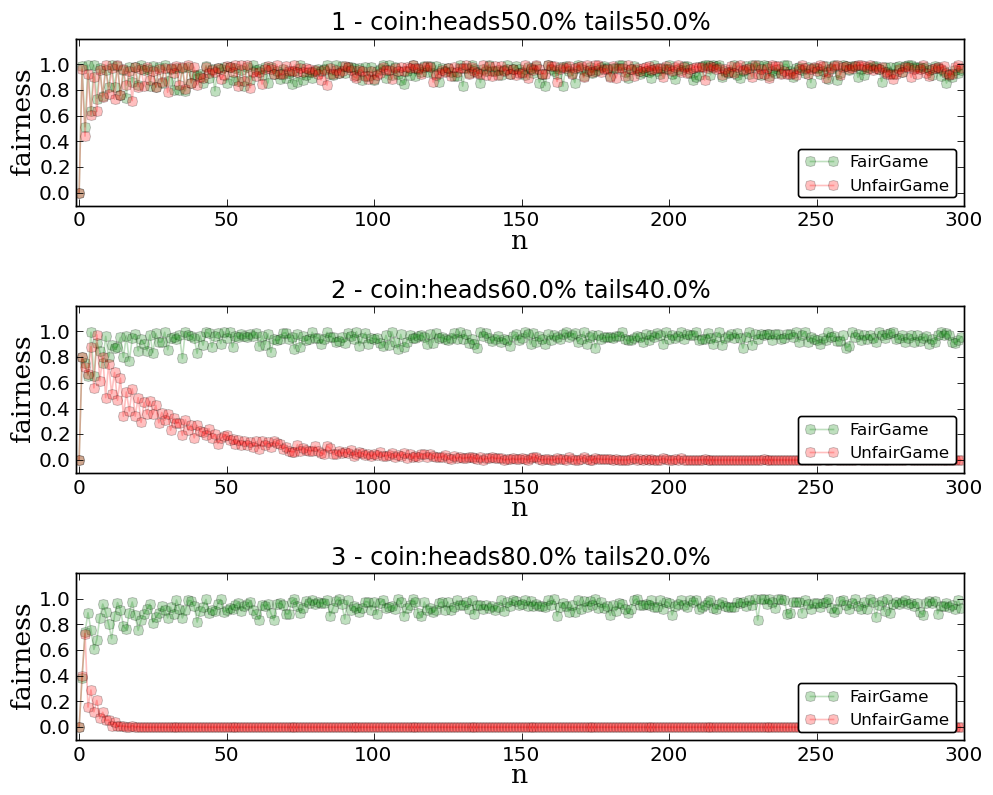

+ Getting a fair result with an unfair coin
+ Please check [this post](http://www.luismartingil.com/blog/puzzle/2013/11/20/puzzle-unfair-coin.html)
+ Demonstrates de puzzle solution using matplotlib to generate the graphics and back my interpretation/solution.

# Problem

How can you get a fair coin toss if someone hands you a coin that is weighted to come up heads more often than tails?

# Solution

## Game with a fair / unfair coin. 
### 50% - 50%.
### 60% - 40%
### 80% - 20%

## Fairness study. Is this method fair?
### Max fairness: 1.0
### Min fairness: 0.0

